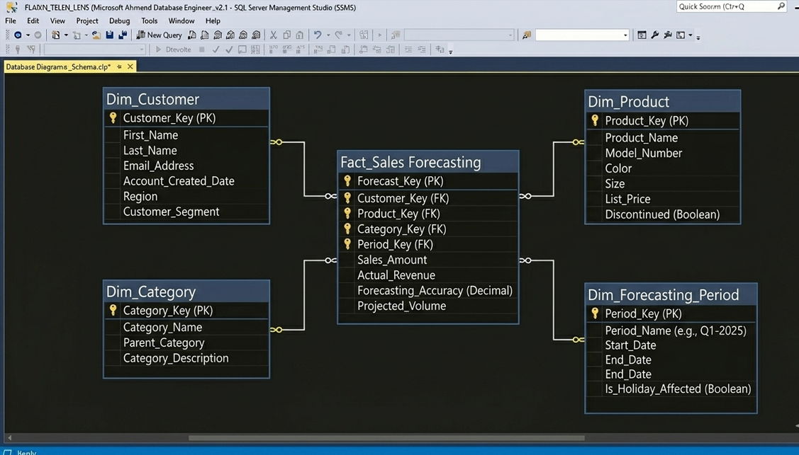
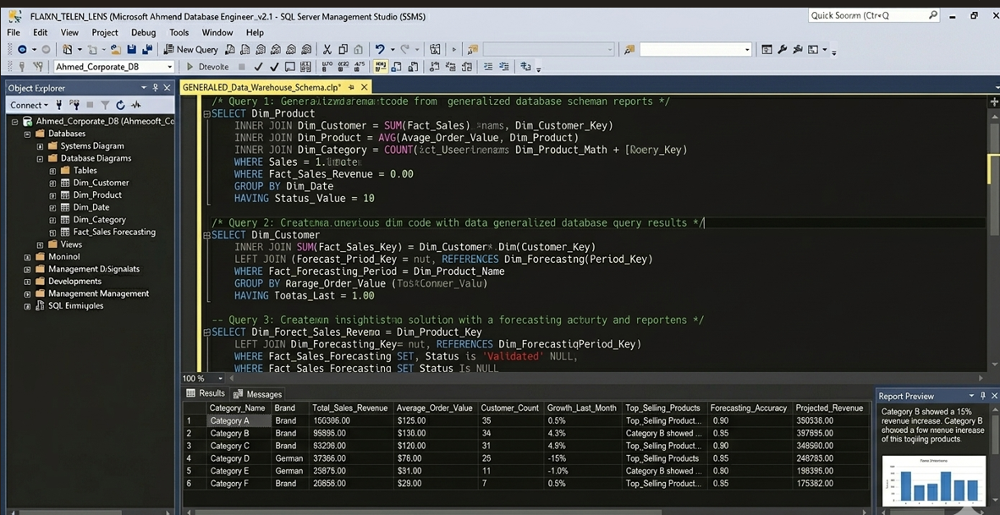

E-commerce Database Design and Sales Forecasting
Overview
This project demonstrates a complete SQL database architecture for an E-commerce system. It includes a professional Star Schema design and advanced queries for sales forecasting and business reporting.

Database Architecture

Implementation and Results

Key Features
Star Schema Design: Optimized for analytical queries.

Data Integrity: Full implementation of PK/FK constraints.

Reporting: Advanced T-SQL scripts for sales insights.
